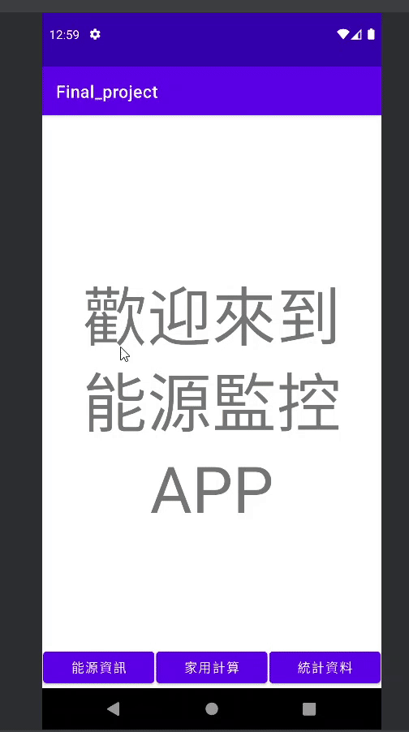
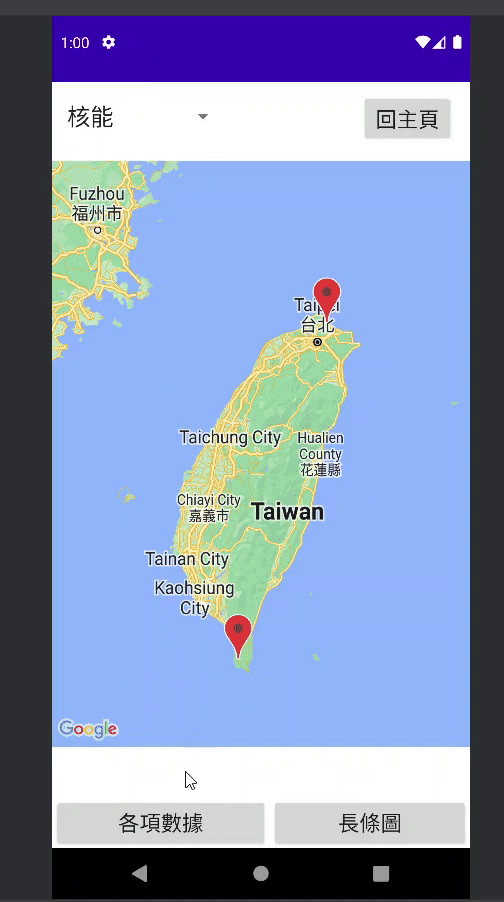
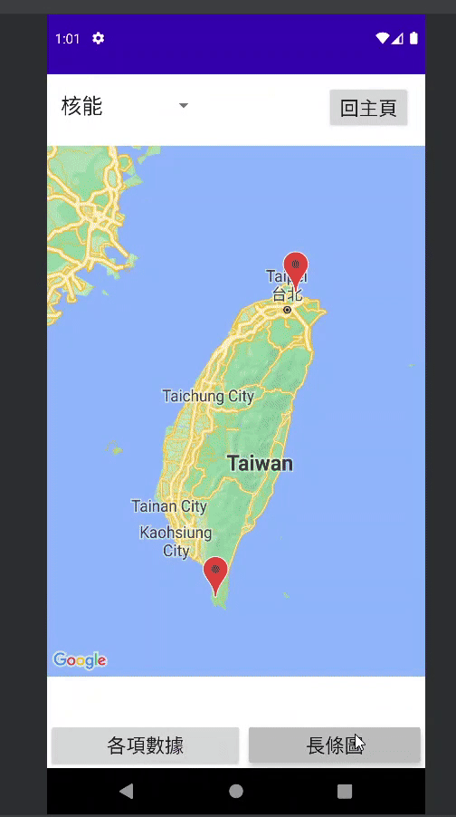
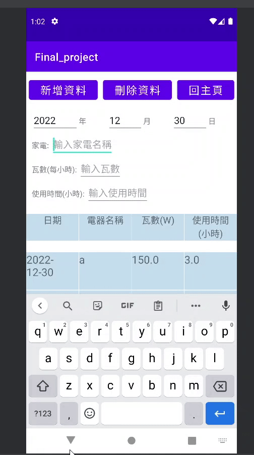
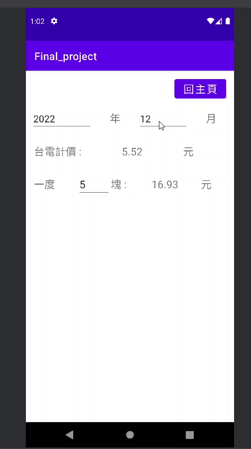

# ⚡️ 能源監控 APP

一款能夠查詢全台發電廠資訊與家庭用電記錄的 Android 手機應用程式，協助用戶即時掌握能源概況與自身電費花費。

---

## 📌 專案特色
- 📍 地圖顯示全台各發電廠的位置與能源類型（火力、水力、風力等）
- 📊 長條圖呈現每月淨發電量，讓使用者更直觀了解能源趨勢
- 📈 表格顯示各廠詳細資訊，如發電方式、地區、輸出量等
- 🧾 支援記錄個人家庭每日用電情況，並根據年月自動計算花費
- 🔄 可新增、刪除、更新每日紀錄，操作簡單、數據一目瞭然

---

## 🔧 使用技術與工具

| 類別     | 技術/工具                |
|----------|---------------------------|
| 語言     | Java                      |
| 平台     | Android (Android Studio)  |
| 資料庫   | SQLite                    |
| 資料來源 | 政府資料開放平台（即時爬蟲） |
| 圖表工具 | MPAndroidChart 函式庫      |

---

## 🚀 功能說明

### 🔍 發電廠資訊查詢
- 即時爬取政府公開資料平台中的發電廠資訊
- 使用地圖顯示所有發電廠位置與分類標記
- 點擊標記即可查看詳細資料（發電量、種類、地點）

### 📊 發電數據圖表
- 使用長條圖顯示該年度每月發電量變化
- 支援不同發電類型的切換顯示

### 🏠 家庭電費紀錄
- 每日記錄家庭用電量
- 選擇日期後會自動顯示當日所有紀錄
- 自動計算每月總花費並顯示結果
- 所有數據皆儲存在本機 SQLite 資料庫中

---

## 📷 畫面展示

- 首頁、地圖、機組和淨發電量 
  
- 各項能源詳細數據 
  
- 長條圖介面 
  
- 新增、刪除用量 
  
- 每月費用計算 
  

---

📁 主程式位置：[`app/src/main/java/com/example/final_project`](app/src/main/java/com/example/final_project)

---
